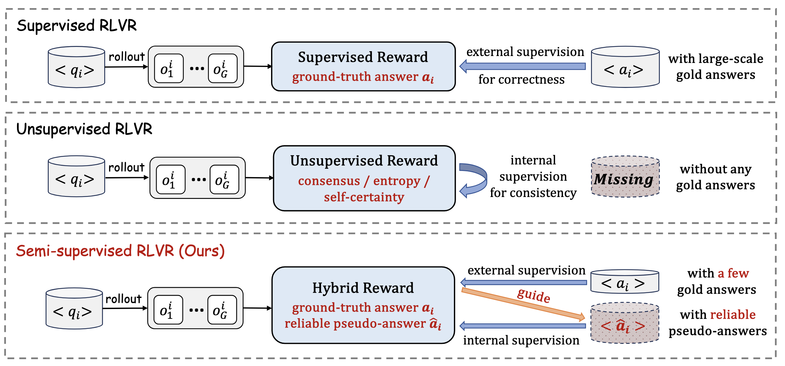
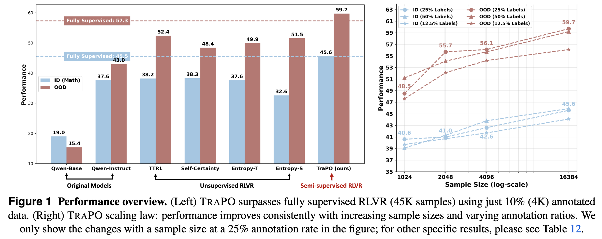

<div align="center">


<h1 style="display: flex; justify-content: center; align-items: center; gap: 10px; margin: 0;"> 
 <!--  -->
  TRAPO: A Semi-Supervised Reinforcement Learning Framework for Boosting LLM Reasoning.
</h1>
<p align="center"><em>TRAPO is A Friend : )</em></p>

<div align="center">
  
</div>


[](https://arxiv.org/abs/2512.13106) [](https://github.com/ShenzhiYang2000/TRAPO)   


</div>

---

# 📚 Overview
- 🎉 [News](#news)  
- 📖 [Introduction](#introduction)  
- ✨ [Getting Started](#getting-started)  
- 🔧 [Usage](#usage)  
- 📃 [Evaluation](#evaluation)  
- 🎈 [Citation](#citation)  
- 🌻 [Acknowledgement](#acknowledgement)  
<!-- - 📈 [Star History](#star-history) -->


---


# 🎉News
<!-- - **[2025/05/30]** We integrate the implementation and scripts of **other off-policy learning methods** including SFT, SFT+RL and RL w/ SFT Loss (multi-task learning).
- **[2025/05/21]** We have updated the paper [version](https://arxiv.org/abs/2504.14945), which re-evaluates all models using a more accurate verifier and adds comparisons with other off-policy learning methods, including RL with SFT Loss and SFT+RL.
- **[2025/04/23]** Our paper now trending on [alphaXiv](https://www.alphaxiv.org/abs/2504.14945)! We welcome feedback and discussion.
- **[2025/04/23]** 🎉 Ranked **#1** of the day on [Huggingface Daily Papers](https://huggingface.co/papers/2504.14945).
- **[2025/04/20]** LUFFY paper available on [arXiv](http://arxiv.org/abs/2504.14945).  -->

<!-- - **[2025/04/20]** The models and datasets are released on [HuggingFace](https://huggingface.co/collections/Elliott/luffy-rl-6804e1f5d1ebe66ba8ac92f4). -->
- **[2025/12/10]** TRAPO codebase is released along with evaluation scripts. Try it out!

---

# 📖Introduction

### Core assumption:
 ```When an unlabeled sample is correctly understood (i.e., its pseudo-label is accurately estimated), its learning dynamics will align consistently with those of labeled samples.```

TraPO is a **semi-supervised** reinforcement learning framework that bridges unlabeled and labeled samples for training large reasoning models (LRMs).

<div align="center">
  
</div>

Built upon GRPO, TraPO leverages a small set of labeled examples to guide training on unlabeled data, ensuring that **only reasoning patterns verified on labeled instances are reinforced**. Its core component identifies reliable unlabeled samples by matching their learning trajectories to those of labeled ones, stabilizing consistency-based training and mitigating model collapse caused by unchecked self-reinforcement.

<div align="center">
  
</div>

<!--  -->


---

# ✨Getting Started

## Installation

You can install TRAPO dependencies by running the following commands:
```bash
conda create -n trapo python=3.10
conda activate trapo
cd trapo
pip install -r requirements.txt
pip install -e .
cd verl
pip install -e .
```

If you encounter issues when installing flash-attn, we recommend you to install it here 
[flash-attn](https://github.com/Dao-AILab/flash-attention/releases/tag/v2.7.3). For example, we use this version. 
```bash
wget https://github.com/Dao-AILab/flash-attention/releases/download/v2.7.3/flash_attn-2.7.3+cu12torch2.4cxx11abiFALSE-cp310-cp310-linux_x86_64.whl
pip install flash_attn-2.7.3+cu12torch2.4cxx11abiFALSE-cp310-cp310-linux_x86_64.whl
```

## Repo Structure

This repository includes:

- `trapo`: Codes for training TRAPO. Our main code changes are in trapo/verl/verl/mix_src.
- `data`: Data and code for training and evaluating TRAPO. 
- `exp_scripts`: Example script to train TRAPO.
- `eval_scripts`: Evaluation scripts on math and out-of-distribution benchmarks.

<!-- LUFFY is built on top of the GRPO framework and supports plug-and-play integration with off-policy traces from models such as DeepSeek-R1. -->

---


# 🔧Usage

## Data Preparation
You need to first run the data preparation script to get the training data in parquet format.
```bash
cd data/code
python prepare_train.py
bash process_data.sh
```


## Training

We provide an example script to train TraPO on our subset of OpenR1-Math-220k. You can run the following command to train TraPO:

```bash
  cd exp_scripts
  bash run_l_1k_u_1k_ood.sh
  bash run_l_1k_u_3k_id.sh
  bash run_l_4k_u_12k_id.sh
```


<!-- ## Inference

Here’s an example for inference:

<details>
<summary>Click to view inference example</summary>

```python
from transformers import AutoTokenizer
from vllm import LLM, SamplingParams

model_path="Elliott/LUFFY-Qwen-Math-7B-Zero"

question = "which number is larger? 9.11 or 9.9?"

tokenizer = AutoTokenizer.from_pretrained(model_path)
messages = [{"role": "user", "content": question}]
chat = tokenizer.apply_chat_template(messages, tokenize=False, add_generation_prompt=True)

llm = LLM(model=model_path)
params = SamplingParams(temperature=0.6, max_tokens=8192)
outputs = llm.generate([chat], params)
print(outputs[0].outputs[0].text)
``` -->

</details>


## Models
The model weights will be uploaded to Hugging Face later.
<!-- | **Model**                          | **Huggingface** |  **Base Model** |
|-----------------------------------|------------------|------------------|
| LUFFY-Qwen-Math-7B-Zero | https://huggingface.co/Elliott/LUFFY-Qwen-Math-7B-Zero |  Qwen2.5-Math-7B |
| LUFFY-Qwen-Math-7B-SFT | https://huggingface.co/Elliott/Qwen2.5-Math-7B-SFT | Qwen2.5-Math-7B |
| LUFFY-Qwen-Math-7B-SFT-RL | https://huggingface.co/Elliott/Qwen2.5-Math-7B-SFT-RL | Qwen2.5-Math-7B |
| LUFFY-Qwen-Math-1.5B-Zero | https://huggingface.co/Elliott/LUFFY-Qwen-Math-1.5B-Zero | Qwen2.5-Math-1.5B |
| LUFFY-Qwen-Instruct-7B | https://huggingface.co/Elliott/LUFFY-Qwen-Instruct-7B | Qwen2.5-7B-Instruct | -->

---

# 📃Evaluation

## Reproducing the Results 
We currently support automated evaluation on six widely used mathematical reasoning benchmarks (AIME24/25, AMC, MATH-500, Minerva, and Olympiad) and three out-of-distribution tasks (ARC-c, GPQA-diamond, and MMLU-pro).

You can reproduce our results by running the following commands:
```bash
ROOT=YOUR_ROOT_PATH
DATA=$ROOT/data/valid.all.parquet

OUTPUT_DIR=./results/
mkdir -p $OUTPUT_DIR

# If you want to evaluate other models, you can change the model path and name.
MODEL_PATH=your_model_path
MODEL_NAME=luffy

if [ $MODEL_NAME == "eurus-2-7b-prime-zero" ]; then
  TEMPLATE=prime
elif [ $MODEL_NAME == "simple-rl-zero" ]; then
  TEMPLATE=qwen
else
  TEMPLATE=own
fi

CUDA_VISIBLE_DEVICES=0,1,2,3 python eval_scripts/generate_vllm.py \
  --model_path $MODEL_PATH \
  --input_file $DATA \
  --remove_system True \
  --add_oat_evaluate True \
  --output_file $OUTPUT_DIR/$MODEL_NAME.jsonl \
  --template $TEMPLATE > $OUTPUT_DIR/$MODEL_NAME.log
```

# Citation
If you find our code useful, please kindly cite our paper:
```bib
@article{yang2025trapo,
  title={TraPO: A Semi-Supervised Reinforcement Learning Framework for Boosting LLM Reasoning},
  author={Yang, Shenzhi and Zhu, Guangcheng and Zheng, Xing and MA, Yingfan and Chen, Zhongqi and Song, Bowen and Wang, Weiqiang and Zhao, Junbo and Chen, Gang and Wang, Haobo},
  journal={arXiv preprint arXiv:2512.13106},
  year={2025}
}
```


# 🌻Acknowledgement

TRAPO builds upon [LUFFY](https://github.com/ElliottYan/LUFFY), [veRL](https://github.com/volcengine/verl) and [deepscaler](https://github.com/agentica-project/rllm), and utilizes [vLLM](https://github.com/vllm-project/vllm) for inference. We utilize [Math-Verify](https://github.com/huggingface/Math-Verify) for math reasoning evaluation. We thank the open-source community for datasets and backbones, including [DeepMath](https://arxiv.org/abs/2504.11456), [NuminaMath](https://huggingface.co/datasets/AI-MO/NuminaMath-CoT), [OpenR1-Math-220k](https://huggingface.co/datasets/open-r1/OpenR1-Math-220k), [Qwen2.5-Math](https://github.com/QwenLM/Qwen2.5-Math), and [DeepSeek-R1](https://github.com/deepseek-ai/deepseek-r1) model. 

Special thanks to [LUFFY](https://github.com/ElliottYan/LUFFY) for providing an excellent codebase and README template, on which we have made modifications and built TRAPO. **In the future, we will release a more lightweight and user-friendly TRAPO framework based on the latest native [veRL](https://github.com/volcengine/verl) implementation.** Lastly, we would like to express our gratitude to [NotebookLM](https://notebooklm.google/) for creating the illustrative diagram of TRAPO.

# 📬 Contact

For questions, feedback, or collaboration opportunities, feel free to reach out:
- Shenzhi Yang: yangshenzhi@zju.edu.cn


